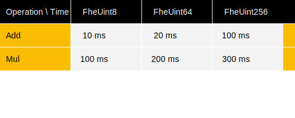

# CPU Benchmarks

This document details the CPU performance benchmarks of homomorphic operations using **TFHE-rs**.

By their nature, homomorphic operations run slower than their cleartext equivalents. The following are the timings for basic operations, including benchmarks from other libraries for comparison.


All CPU benchmarks were launched on an `AWS hpc7a.96xlarge` instance equipped with an `AMD EPYC 9R14 CPU @ 2.60GHz` and 740GB of RAM.


## Integer operations

The following tables benchmark the execution time of some operation sets using `FheUint` (unsigned integers). The `FheInt` (signed integers) performs similarly.

The next table shows the operation timings on CPU when all inputs are encrypted



The next table shows the operation timings on CPU when the left input is encrypted and the right is a clear scalar of the same size:



All timings are based on parallelized Radix-based integer operations where each block is encrypted using the default parameters `PARAM_MESSAGE_2_CARRY_2_KS_PBS`. To ensure predictable timings, we perform operations in the `default` mode, which ensures that the input and output encoding are similar (i.e., the carries are always emptied).

You can minimize operational costs by selecting from 'unchecked', 'checked', or 'smart' modes from [the fine-grained APIs](../../references/fine-grained-apis/quick\_start.md), each balancing performance and correctness differently. For more details about parameters, see [here](../../references/fine-grained-apis/shortint/parameters.md). You can find the benchmark results on GPU for all these operations [here](../../guides/run\_on\_gpu.md#benchmarks).

## Programmable bootstrapping

The next table shows the execution time of a keyswitch followed by a programmable bootstrapping depending on the precision of the input message. The associated parameter set is given. The configuration is Concrete FFT + AVX-512.



# Styled Data Table

<table border="1" cellspacing="0" cellpadding="5" style="border-color: white;">
    <thead>
        <tr style="background-color: black; color: white;">
            <th>Operation \ Time</th>
            <th>FheUint8</th>
            <th>FheUint64</th>
            <th>FheUint256</th>
        </tr>
    </thead>
    <tbody>
        <tr>
            <td style="background-color: #fbbc04; color: black; border-color: white;">Add</td>
            <td style="background-color: #f3f3f3; color: black; text-align: center; border-color: white;">10 ms</td>
            <td style="background-color: #f3f3f3; color: black; text-align: center; border-color: white;">20 ms</td>
            <td style="background-color: #f3f3f3; color: black; text-align: center; border-color: white;">100 ms</td>
        </tr>
        <tr>
            <td style="background-color: #fbbc04; color: black; border-color: white;">Mul</td>
            <td style="background-color: #f3f3f3; color: black; text-align: center; border-color: white;">100 ms</td>
            <td style="background-color: #f3f3f3; color: black; text-align: center; border-color: white;">200 ms</td>
            <td style="background-color: #f3f3f3; color: black; text-align: center; border-color: white;">300 ms</td>
        </tr>
    </tbody>
</table>

<iframe srcdoc='<table border="1" cellspacing="0" cellpadding="5" style="border-color: white;">
    <thead>
        <tr style="background-color: black; color: white;">
            <th>Operation \ Time</th>
            <th>FheUint8</th>
            <th>FheUint64</th>
            <th>FheUint256</th>
        </tr>
    </thead>
    <tbody>
        <tr>
            <td style="background-color: #fbbc04; color: black; border-color: white;">Add</td>
            <td style="background-color: #f3f3f3; color: black; text-align: center; border-color: white;">10 ms</td>
            <td style="background-color: #f3f3f3; color: black; text-align: center; border-color: white;">20 ms</td>
            <td style="background-color: #f3f3f3; color: black; text-align: center; border-color: white;">100 ms</td>
        </tr>
        <tr>
            <td style="background-color: #fbbc04; color: black; border-color: white;">Mul</td>
            <td style="background-color: #f3f3f3; color: black; text-align: center; border-color: white;">100 ms</td>
            <td style="background-color: #f3f3f3; color: black; text-align: center; border-color: white;">200 ms</td>
            <td style="background-color: #f3f3f3; color: black; text-align: center; border-color: white;">300 ms</td>
        </tr>
    </tbody>
</table>' style="height:200px;width:100%;border:none;overflow:hidden;" name="test">You need a Frames Capable browser to view this content.</iframe> 



<svg width="300" height="130" xmlns="http://www.w3.org/2000/svg">
  <rect width="200" height="100" x="10" y="10" rx="20" ry="20" fill="blue" />
  Sorry, your browser does not support inline SVG.
</svg>




## Reproducing TFHE-rs benchmarks

**TFHE-rs** benchmarks can be easily reproduced from the [source](https://github.com/zama-ai/tfhe-rs).


AVX512 is now enabled by default for benchmarks when available


The following example shows how to reproduce **TFHE-rs** benchmarks:

```shell
#Boolean benchmarks:
make bench_boolean

#Integer benchmarks:
make bench_integer

#Shortint benchmarks:
make bench_shortint
```
